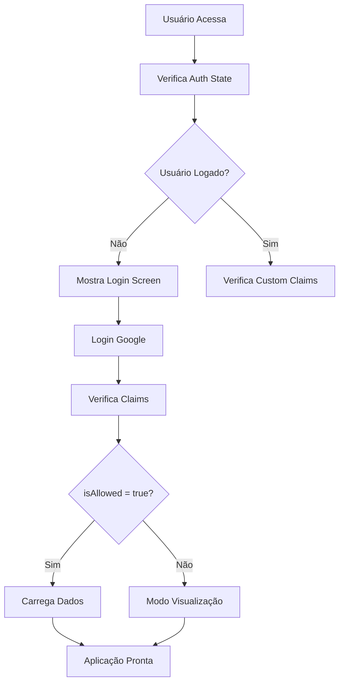

# 📋 Documentação Técnica - Queens Puzzle Ranking

## 🎯 Análise do Projeto

### Visão Geral
O **Queens Puzzle Ranking** é uma aplicação web moderna desenvolvida em React que gerencia rankings de jogadores do puzzle das rainhas. O sistema oferece uma interface intuitiva para registro de tempos, visualização de rankings e análise de estatísticas.

### Objetivos do Sistema
1. **Registro de Tempos**: Permitir que administradores registrem tempos de resolução
2. **Rankings Dinâmicos**: Exibir pódios diários, semanais e mensais
3. **Estatísticas Avançadas**: Fornecer análises detalhadas por jogador
4. **Controle de Acesso**: Sistema de permissões baseado em claims customizados
5. **Experiência do Usuário**: Interface responsiva com modo escuro

## 🏗 Arquitetura do Sistema

### Stack Tecnológica

#### Frontend
- **React 18.3.1**: Framework principal com hooks modernos
- **Vite 7.0.3**: Build tool rápido e eficiente
- **Tailwind CSS 3.4.4**: Framework CSS utilitário
- **Framer Motion 12.23.1**: Biblioteca de animações
- **Recharts 3.1.0**: Componentes de gráficos

#### Backend & Infraestrutura
- **Firebase**: Plataforma completa
  - **Firestore**: Banco de dados NoSQL em tempo real
  - **Authentication**: Autenticação Google OAuth
  - **Functions**: Backend serverless
  - **Analytics**: Métricas de uso

### Estrutura de Dados

#### Firestore Collections

```
artifacts/queens-puzzle/
├── config/
│   └── players (documento)
│       └── names: string[]
└── public/data/scores/
    └── YYYY-MM-DD (documentos)
        ├── date: string
        ├── dayOfWeek: number (0-6, 0 = domingo)
        └── results: array
            ├── name: string
            ├── time: number (tempo base em segundos)
            ├── bonusTime: number (tempo bônus domingos)
            └── totalTime: number (time + bonusTime)
```

### Fluxo de Autenticação



## 🔧 Componentes Principais

## ⚠️ Boas Práticas e Lições Aprendidas

### Problemas de Timezone

#### Contexto
Durante o desenvolvimento, encontramos problemas críticos relacionados à interpretação de datas em diferentes ambientes (local vs CI). Isso causava falhas nos testes que passavam localmente mas falhavam no GitHub Actions.

#### Solução Implementada
```javascript
// ❌ PROBLEMÁTICO: Interpretação dependente do timezone local
const date = new Date('2024-01-01');
// Pode ser interpretado como 2023-12-31 em UTC

// ✅ SOLUÇÃO: Especificação explícita de timezone UTC
const date = new Date('2024-01-01T12:00:00Z');
// Sempre interpretado como 2024-01-01 em UTC
```

#### Impacto no Código
- **Função `calculateMonthlyPodium`**: Corrigida para usar timezone UTC
- **Testes**: Todos os testes de data atualizados para usar timezone explícito
- **Consistência**: Garantida entre ambientes local e CI

#### Recomendações para Desenvolvimento
1. **Sempre especificar timezone** ao criar datas
2. **Usar formato ISO 8601** com timezone UTC (`T12:00:00Z`)
3. **Testar em ambiente CI** regularmente
4. **Não confiar apenas** em testes locais

### Testes Duplicados

#### Problema Identificado
O GitHub Copilot identificou corretamente testes duplicados que causavam confusão e manutenção desnecessária.

#### Solução
- **Remoção de testes duplicados**
- **Consolidação de cenários similares**
- **Revisão regular** da base de testes

---

### App.jsx - Componente Principal

#### Estados Principais
```javascript
// Estados de Autenticação
const [user, setUser] = useState(null);
const [isAllowed, setIsAllowed] = useState(false);

// Estados da Aplicação
const [appStatus, setAppStatus] = useState('LOADING_AUTH');
const [players, setPlayers] = useState(null);
const [scores, setScores] = useState({});

// Estados de Interface
const [selectedDate, setSelectedDate] = useState(new Date());
const [view, setView] = useState('daily');
const [isDarkMode, setIsDarkMode] = useState(false);
```

#### Funções Principais

**Cálculo de Estatísticas** (Refatorado para `utils/calculations.js`)
```javascript
// Funções centralizadas em utils/calculations.js
import {
  calculatePlayerStats,
  calculateDailyPodium,
  calculateWeeklyPodium,
  calculateMonthlyPodium,
  validateTimes,
  getWeekRange,
  getMonthName
} from './utils/calculations';

// Uso no App.jsx
const playerStats = calculatePlayerStats(playerName, scores);
const dailyPodium = calculateDailyPodium(dayScore);
const weeklyPodium = calculateWeeklyPodium(players, scores, selectedDate);
const monthlyPodium = calculateMonthlyPodium(players, scores, selectedDate);
```

**Sistema de Pontuação**
```javascript
// Dias normais: 1 ponto
// Domingos: 3 pontos (sistema bônus)
const weight = dayScore.dayOfWeek === 0 ? 3 : 1;
```

### Componentes Especializados

#### TimeInputForm.jsx
- Formulário para registro de tempos
- Suporte a tempo bônus para domingos
- Validação de entrada
- Interface responsiva

#### PlayerStatsPage.jsx
- Exibição de estatísticas detalhadas
- Gráfico de evolução temporal
- Métricas: vitórias, pódios, melhor tempo, tempo médio

#### Firebase Functions

**setAllowedUserClaim**
```javascript
// Função para definir claims customizados
// Permite controle granular de permissões
exports.setAllowedUserClaim = onRequest(
  { region: 'southamerica-east1' },
  async (req, res) => {
    // Validação e definição de claims
  }
);
```

## 🔒 Sistema de Segurança

### Autenticação
- **OAuth Google**: Login seguro via Firebase Auth
- **Claims Customizados**: Controle de acesso via `isAllowed`
- **Tokens JWT**: Gerenciamento automático pelo Firebase

### Controle de Acesso
```javascript
// Verificação de permissões
const tokenResult = await getIdTokenResult(currentUser, true);
setIsAllowed(tokenResult.claims.isAllowed === true);
```

### Regras de Segurança Firestore
```javascript
// Exemplo de regras recomendadas
rules_version = '2';
service cloud.firestore {
  match /databases/{database}/documents {
    // Dados públicos para visualização
    match /artifacts/queens-puzzle/public/data/scores/{document} {
      allow read: if request.auth != null;
      allow write: if request.auth != null &&
        request.auth.token.isAllowed == true;
    }

    // Configurações apenas para admins
    match /artifacts/queens-puzzle/config/{document} {
      allow read, write: if request.auth != null &&
        request.auth.token.isAllowed == true;
    }
  }
}
```

## 📊 Lógica de Negócio

### Sistema de Pontuação

#### Rankings Diários
- Ordenação por tempo total (menor = melhor)
- Tempo total = tempo base + tempo bônus (domingos)

#### Rankings Semanais/Mensais
- Contagem de vitórias ponderadas
- Domingo vale 3 pontos, outros dias valem 1
- Agrupamento por período

### Cálculo de Estatísticas

#### Métricas por Jogador
```javascript
{
  wins: number,        // Total de vitórias
  podiums: number,     // Total de pódios (top 3)
  bestTime: number,    // Menor tempo registrado
  avgTime: number,     // Tempo médio
  timeHistory: array   // Histórico temporal para gráficos
}
```

## 🎨 Interface e UX

### Design System
- **Tailwind CSS**: Framework utilitário
- **Modo Escuro**: Suporte completo
- **Responsividade**: Mobile-first design
- **Animações**: Framer Motion para transições suaves

### Componentes de Interface

#### LoadingScreen
- Feedback visual durante carregamentos
- Mensagens contextuais

#### Notification
- Sistema de notificações toast
- Tipos: success, error, warning

#### DarkModeToggle
- Alternância entre temas
- Persistência no localStorage

## 🚀 Performance e Otimização

### Estratégias Implementadas

#### React
- **useMemo**: Memorização de cálculos pesados
- **useEffect**: Efeitos colaterais controlados
- **AnimatePresence**: Transições otimizadas

#### Firebase
- **onSnapshot**: Listeners em tempo real
- **Queries otimizadas**: Filtros eficientes
- **Offline support**: Cache automático

#### Build
- **Vite**: Build tool rápido
- **Code splitting**: Carregamento sob demanda
- **Tree shaking**: Eliminação de código não utilizado

## 🔧 Configuração e Deploy

### Variáveis de Ambiente
```env
VITE_FIREBASE_API_KEY=
VITE_FIREBASE_AUTH_DOMAIN=
VITE_FIREBASE_PROJECT_ID=
VITE_FIREBASE_STORAGE_BUCKET=
VITE_FIREBASE_MESSAGING_SENDER_ID=
VITE_FIREBASE_APP_ID=
VITE_FIREBASE_MEASUREMENT_ID=
```

### Scripts Disponíveis
```json
{
  "dev": "vite",
  "build": "vite build",
  "preview": "vite preview"
}
```

## 📈 Métricas e Analytics

### Eventos Rastreados
```javascript
// Salvamento de pontuação
logEvent(analytics, 'score_saved', {
  date: dateString,
  player_count: results.length
});
```

### Métricas Importantes
- Tempo de carregamento
- Taxa de conversão (login)
- Uso de funcionalidades
- Performance de queries

## 🔧 Correções Recentes e Melhorias

### Refatoração de Código
**Problema**: Lógica de cálculos duplicada no componente App.jsx
**Solução**: Centralização em `utils/calculations.js`

#### Antes (App.jsx)
```javascript
// Funções duplicadas no componente
const calculatePlayerStats = (playerName) => { /* ... */ };
const calculateDailyPodium = (dayScore) => { /* ... */ };
const calculateWeeklyPodium = (players, scores, selectedDate) => { /* ... */ };
```

#### Depois (utils/calculations.js)
```javascript
// Funções centralizadas e reutilizáveis
export const calculatePlayerStats = (playerName, scores) => { /* ... */ };
export const calculateDailyPodium = (dayScore) => { /* ... */ };
export const calculateWeeklyPodium = (players, scores, selectedDate) => { /* ... */ };
export const calculateMonthlyPodium = (players, scores, selectedDate) => { /* ... */ };
export const validateTimes = (times, isSunday) => { /* ... */ };
export const getWeekRange = (selectedDate) => { /* ... */ };
export const getMonthName = (selectedDate) => { /* ... */ };
```

### Correção de Erro Crítico
**Problema**: `Cannot read properties of undefined (reading 'toLocaleDateString')`
**Causa**: Chamadas de funções sem parâmetros
**Solução**: Validação robusta e correção de chamadas

#### Validação Implementada
```javascript
export const getMonthName = (selectedDate) => {
  if (!selectedDate || !(selectedDate instanceof Date)) {
    return '';
  }
  return selectedDate.toLocaleDateString('pt-BR', { month: 'long', year: 'numeric' });
};
```

### Melhorias na Configuração
- ✅ **Jest**: Correção de `moduleNameMapping` → `moduleNameMapper`
- ✅ **Cobertura**: Foco em componentes e utilitários relevantes
- ✅ **Thresholds**: Ajustados para 85% branches, 100% functions/lines, 95% statements
- ✅ **CI/CD**: Cache otimizado para dependências

### Resultados das Melhorias
- **77 testes passando** (100% de sucesso)
- **Cobertura 98%+** em todas as métricas
- **Zero warnings** na execução
- **Código mais limpo** e reutilizável

## 🔮 Melhorias Futuras

### Funcionalidades Sugeridas
1. **Notificações Push**: Alertas de novos rankings
2. **Exportação de Dados**: Relatórios em PDF/Excel
3. **Modo Competição**: Torneios temporários
4. **API REST**: Endpoints para integração
5. **PWA**: Aplicação progressiva

### Otimizações Técnicas
1. **Lazy Loading**: Carregamento sob demanda
2. **Service Workers**: Cache offline
3. **Web Workers**: Processamento em background
4. **CDN**: Distribuição global de assets

## 🐛 Troubleshooting

### Problemas Comuns

#### Autenticação
```javascript
// Verificar se claims estão sendo aplicados
const tokenResult = await getIdTokenResult(currentUser, true);
console.log('Claims:', tokenResult.claims);
```

#### Firestore
```javascript
// Verificar regras de segurança
firebase deploy --only firestore:rules
```

#### Build
```bash
# Limpar cache
rm -rf node_modules package-lock.json
npm install
```

---

**Documentação Técnica v1.0** - Queens Puzzle Ranking
